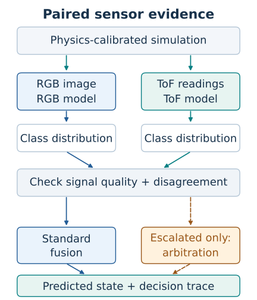

# PC-MEF

Research software for testing how camera images and depth data identify liquid states inside pipes.

Can physics-calibrated simulation reduce the gap to real sensor data? Can selective evidence arbitration make RGB–ToF fusion more stable under stress?

**Research in progress.** Calibration is partial; final evaluation is not complete. See [research status](STATUS.md) for the recorded evidence and remaining limits.

[Explore the method](#method-and-experiments) · [Start locally](#quick-start) · [Technical details](#technical-details)

<p align="center"></p>

Method overview, not a result figure. The [figure source and code references](docs/assets/README.md) explain each step.

## Method and experiments

PC-MEF is a master's-thesis experiment platform for intra-pipe liquid-state identification. RGB supplies visual evidence; time-of-flight (ToF) sensor readings supply distance and return-signal evidence.

- **E1 — simulation fidelity:** does calibrated simulation better match frozen held-out real recordings than initial simulation?
- **E2 — sensor fusion:** in paired synthetic stress scenarios, is adaptive PC-MEF (G5) more stable than reliability fusion (G4)? These are research questions, not claimed improvements.

The implemented workflow covers physics simulation, paired RGB–ToF generation, perception models, reliability checks, selective routing, and evidence arbitration. A local console exposes the method and run records; reporting code produces traces, metrics, and figures when the required run artifacts exist.

| Input | Processing | Output |
|---|---|---|
| Scene geometry, media, light, and calibration settings | Time-resolved simulation and sensor mapping | Paired RGB arrays and ToF recordings |
| Paired observations and frozen models/settings | Perception, reliability checks, routing; arbitration for escalated cases | Class probabilities, predicted liquid state, and decision trace |
| Run artifacts and experiment settings | Evaluation and reporting | Reports, metrics, and research figures |

The four classes are **Bubbly, Empty, Misty, and Water-filled**. Private recordings, trained artifacts, and run-specific locks are not supplied by a fresh clone. The code repository alone does not reproduce the recorded research results.

## Quick Start

On Windows with Python 3.10 installed:

```powershell
git clone https://github.com/SpadesZ/PC-MEF.git
cd PC-MEF
py -3.10 -m venv .venv
.\.venv\Scripts\Activate.ps1
python -m pip install -e ".[dev,admin]"
pcmef --help
pcmef version
pcmef config check
```

If shell policy blocks activation, use `.\.venv\Scripts\python.exe -m pcmef.cli --help` and the same interpreter for the other commands. On other platforms, use a Python 3.10+ virtual environment and its activation command; the package declares Python `>=3.10`.

The current CLI loads the admin module when it builds its command list, so this starting environment includes the `admin` extra even for `--help`. It does not start a server.

This checks installation and lists unresolved research settings, if any. It does **not** render a scene, contact a model provider, or execute a formal experiment. Expected output includes the CLI command list, the package version, and a configuration report. Unresolved values must be approved or derived by the declared research procedure; do not fill them with guesses.

Run the small CLI check from the repository root:

```powershell
python -m pytest tests/test_cli.py -q
```

### Optional dependencies

Install only the groups needed for the workflow you intend to use:

```powershell
python -m pip install -e ".[simulation]" # Mitsuba, Dr.Jit, mitransient
python -m pip install -e ".[perception]" # PyTorch
python -m pip install -e ".[agents]"     # HTTP client, JSON validation, Pillow
python -m pip install -e ".[admin]"      # Already included in the Quick Start
python -m pip install -e ".[figures]"    # Matplotlib
```

Simulation also needs its platform-specific runtime. Perception needs the matching model/data artifacts; provider-backed arbitration needs configured credentials and bindings. Installing an extra does not complete these prerequisites. See [pyproject.toml](pyproject.toml) for the dependency declarations.

## Research status and reproducibility

The repository includes simulation, perception, fusion, console, reporting, and formal-run safeguards. The former “Batch 1 / 146 tests / M0 blocked” README summary is obsolete; [STATUS.md](STATUS.md) retains the dated implementation and research records.

Final E2 is not complete. The latest recorded research checks use synthetic fixtures for lifecycle behavior; they do not validate the full formal decision loop or the producer trace under a real provider. Final families 36–43 remain reserved and are not inputs to this Quick Start or this method figure.

To interpret or reproduce an experiment, keep its data split, calibration, model settings, frozen configuration, code revision, and run artifacts together. The relevant starting points are:

- [Research status and dated execution evidence](STATUS.md)
- [Current method and console implementation](pcmef/console/pipeline.py)
- [Specification-to-current-version differences](docs/SAI_v0.6.0_TO_CURRENT_DELTA.md)
- [Decision records](docs/NOTES.md)

Do not treat a successful install, a passing CLI test, or an old test count as a completed research evaluation.

## Technical Details

### Original research title

結合物理校準模擬與大型語言模型輔助多模態融合之管內液態狀態辨識
（Intra-Pipe Liquid-State Identification Integrating Physics-Calibrated Simulation and Large Language Model-Assisted Multimodal Fusion）

### 規格來源

| ID | 文件 |
|---|---|
| `SRC-PLAN` | PC-MEF 實驗計畫 v0.9.7S — Evidence-Integrity Hardened Thesis Core |
| `SRC-SAI` | PC-MEF SAI v0.5.0 — LLM Setup / Task Binding Integrated |

原工作站文件位於 `Desktop\pre碩論\正式可用\正式實驗`，不是 clone 後可取得的公開路徑。本 repo 不重寫論文內容，只把規格轉成可執行、可 freeze 的系統。

### 設計原則

CLI-first / local-first / provenance-first / truth-firewall /
real-split-lock / scientific-outcome / hard-freeze / paired-formal integrity。

三條非協商的紅線：

1. **未核定數值不得補預設值。** 所有待教授裁決的數字以 `!required` 標記，讀到即拋 `FormalBlockingError`。見 [NOTE-005](docs/NOTES.md)。
2. **Provider 只能看到 opaque evidence。** class / condition / severity / parent_scene_family / 檔名路徑一律不得進入 InferencePayload。見 [NOTE-003、NOTE-004](docs/NOTES.md)。
3. **Lock 不可覆寫、不可跳步。** 22 個 formal lock 有明確前置順序，內容變更必須開新 run。

### 常用研究與維護指令

以下在已啟用的虛擬環境中執行。原工作站以 `py -3.10` 執行；不再要求所有使用者依賴相同的全域 PATH 設定。

```powershell
python -m pytest                             # 全部測試；可能需要額外相依與研究資料
pcmef config check                           # 列出待教授裁決的數值
pcmef --formal config show                   # formal 模式（有缺值即 exit 2）
pcmef locks status                           # 各 formal lock 的凍結狀態與前置條件

# M0：盤點前研究資料（來源全程唯讀；需自行提供資料）
pcmef audit real-data --source data/raw_real --out data/inventory
```

`audit real-data` 產出四份 artifact：`source_inventory.csv`、`measurement_alignment.csv`、`exclusion_ledger.csv`、`audit_report.json`，並回報五層計數（nominal / physical / canonical / valid / e1-eligible）。四個 metric 依**檔名編號**配對而非排序位置——原因見 [NOTE-010](docs/NOTES.md)。

### 檔頭與決策記錄規範

每個原始檔開頭都有十欄位維護契約，欄位順序固定：
`上下游／檔案路徑／產生時間／版本／功能說明／模組定位／主要責任／維護提醒／驗證方式`。
其中 `功能說明`（白話在做什麼）、`模組定位`（架構位置與邊界）、`主要責任`（編號職責清單）三者分開寫，不合併。

決策層級的理由不寫檔頭，寫 [docs/NOTES.md](docs/NOTES.md)，每則條目五欄齊備：
`決策日期／適用範圍／決策／原因／驗證`。程式中的 `NOTE(NOTE-NNN)` 必須能在該檔找到同號條目，禁止失效引用。

這兩條規範由 `tests/test_repo_integrity.py` 自動稽核：欄位缺漏、順序錯誤、`檔案路徑` 與實際位置不符、`驗證方式` 指向不存在的檔案、NOTE 引用找不到條目、NOTE 條目缺欄位、NOTE 編號重用——全部會讓 CI 失敗。

```powershell
python -m pytest tests/test_repo_integrity.py -v
```
